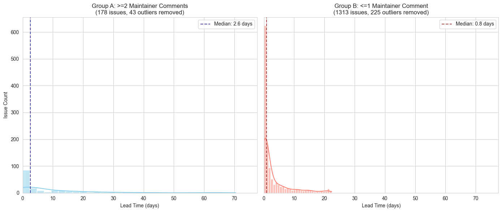

# github-lead-time-analysis

Python notebook to analyze lead time of issues in most popular GitHub repositories in two groups: with <=1 and >=2 maintainers in the comments.

## Running

Copy `.env.sample` to `.env` and fill in your GitHub token.

Then install the dependencies in `venv`:

```bash
# Create and activate virtual environment
python -m venv venv
source venv/bin/activate  # On macOS/Linux
# or
venv\Scripts\activate  # On Windows

# Install dependencies
pip install -r requirements.txt

# Register the virtual environment as a Jupyter kernel
python -m ipykernel install --user --name=github-analysis
```

And then run the notebook:

```bash
jupyter notebook
```

## Sample Output


